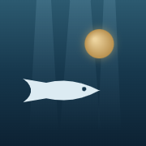

# Fathom - Deep-Sea Focus Aquarium

*Fathom: a measure of depth, and what your focus does to a problem.*

[Open Fathom on GitHub Pages](https://ycakan.github.io/Fathom/)

Fathom is a calm, ambient focus timer designed to give you a low-friction
environment without distractions. Start a session, let the deep-sea aquarium sit
quietly in the background, and watch your focused time turn into a living tank of
creatures, fauna, and forgotten wreckage.

The app is intentionally minimal: no accounts, no feeds, no productivity theater,
and no cluttered dashboards. It is built around a simple loop of focused time,
gentle rewards, and a moody visual atmosphere that makes staying present feel a
little more tactile.

## What it does

- **Ambient focus sessions** - choose 15/30/60/90 minutes or set a custom length.
  Pause and resume any time; only unpaused focus time counts.
- **Distraction-free rewards** - every 15 minutes earns 1 coin, with rewards
  quietly banked in the background.
- **A growing aquarium** - spend coins on 17 sea creatures, from minnows and
  jellyfish to seahorses, axolotls, an orca, and a rare dragon fish.
- **Depth decorations** - unlock one-time fauna and shipwreck finds like kelp
  groves, coral fans, tube worm colonies, anchors, broken skiffs, and sunken
  hulls.
- **Subtle interactions** - click creatures for small reactive moments: sharks
  lunge, crabs raise their claws, octopuses vanish behind ink, and the dragon
  fish can trigger rare abyssal effects.
- **Local-first persistence** - coins, focus history, creatures, decorations,
  and active sessions are stored in `localStorage`.

## Design goals

Fathom is made to feel like an ambient companion rather than a task manager. The
interface stays quiet, the controls stay sparse, and the aquarium gives you a
soft sense of progress without demanding attention. It is a focus space for deep
work, study sessions, reading, writing, or any stretch of time where you want the
screen to support concentration instead of compete with it.

## Use it on your phone

Fathom installs as a home-screen web app — fullscreen, with its own icon, no
browser chrome, and no App Store required.

**iPhone / iPad**

1. Open [ycakan.github.io/Fathom](https://ycakan.github.io/Fathom/) in **Safari**
2. Tap **Share** → **Add to Home Screen** → **Add**

**Android**: open the same link in Chrome and choose **Install app** from the
menu.

Good to know:

- **Works offline** — a service worker caches the app after the first visit, so
  it launches even in airplane mode.
- **Your tank lives on the device.** The installed app has its own storage,
  separate from the browser tab version, and is exempt from Safari's periodic
  website-data cleanup.
- **Sessions survive closing the app** — the timer is timestamp-based, so
  locking the phone or switching apps doesn't lose progress. While a session
  runs, the screen stays awake.
- **Updates arrive automatically** the next time you launch the app online.

## License

MIT
